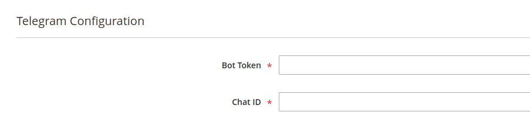

# For Developers: Writing a custom adapter

MSP Notifier comes with a set of adapter provided by `msp/module-notifier-core-adapters`, but you are free to write your own
adapter and add it system wide.

> Click [here](//github.com/magespecialist/notifier-core-adapters) to see a full working example. 

## How to write it

Entities you need to define while writing a new adapter:

- Adapter Engine
- Form Modifier for custom parameters
- Message Validator
- Parameters Validator

## Adapter engine

An adapter engine is a class implementing `MSP\Notifier\Model\AdapterEngine\AdapterEngineInterface`.<br />
This class is responsible for **taking a message and delivering it to its destination**.

It has a single `execute` public method with the following prototype:

`public function execute(string $message, array $params = []): bool`

> Check [Telegram Adapter](//github.com/magespecialist/notifier-core-adapters/blob/master/Model/AdapterEngine/Telegram.php) for a working example.

This method **MUST** do at least three tasks:

- Deliver the message (defined by `$message`) using a configuration (defined by `$params`)
- Return `true` in case of success
- **Throw an exception** in case of failure

**IMPORTANT:** this method should never return `false`. In case of failure **it MUST throw an exception**.

### Parameters

The variable `$params` is an associative array and it comes from your **channel's configuration**.

If we take as an example the Telegram adapter, we can see it requires a `token` and a `chat_id`.
We will find these parameters inside `$params` as a hash:

```
array(
    'token' => 'my_configured_token',
    'chat_id' => 'my_configured_chat_id'
)
```

> Check [Channels section](./Fundamentals#channels) for further information on channels configuration.

> See the following chapter to understand how to define adapter specific parameters.

## Form Modifier for custom parameters

Each adapter may need **additional parameters** to work. A hypothetical `email` adapter will require a recipient email as
well as a `telegram` adapter will require a `token` and a `chat_id` to deliver its message.

In order to make each adapter independent and 100% flexible, we provided a `DataProvider` modifier mechanism to inject custom
fields in the form configuration.

Example:

```
...
<virtualType name="MSP\Notifier\Ui\DataProvider\Form\Channel\Modifier\Pool">
    <arguments>
        <argument name="modifiers" xsi:type="array">
            <item name="my_custom_adapter" xsi:type="array">
                <item name="class"
                      xsi:type="string">My\NameSpace\Ui\DataProvider\Form\Channel\Modifier\MyAdapter</item>
                <item name="sortOrder" xsi:type="number">1000</item>
            </item>
        </argument>
    </arguments>
</virtualType>
...
```

Your custom DataProvider class must:

- Implement `MSP\Notifier\Model\Channel\ModifierInterface`
- Define a method `getAdapterCode` returning the code of the adapter you are referring to
- Define a `modifyMeta` and `modifyData` as required by Magento Modifiers

Your parameters list and configuration will be provided as UI Form component structure, from `modifyMeta` method.

> Check [here](//github.com/magespecialist/notifier-core-adapters/blob/master/Ui/DataProvider/Form/Channel/Modifier/Telegram.php) to see a working example.

Additional parameters will be automatically added to your channel configuration form when your adapter will be selected.

Example for Telegram adapter:



## Validators

Params validation can be defined both via `VirtualType` and concrete class. A set of basic validation is provided with
the core package, but you are free to write your own validator.

The following example is a check to make sure all the parameters are defined and your message is not empty:

```
<virtualType name="My\NameSpace\Model\AdapterEngine\ParamsValidator\MyAdapter\Required"
                 type="MSP\Notifier\Model\AdapterEngine\ParamsValidator\Required">
    <arguments>
        <argument name="requiredParams" xsi:type="array">
            <item name="my_required_paramter" xsi:type="string">my_required_paramter</item>
            <item name="my_other_required_paramter" xsi:type="string">my_other_required_paramter</item>
        </argument>
    </arguments>
</virtualType>
...
<virtualType name="My\NameSpace\Model\AdapterEngine\ValidatorChain\MyAdapter"
             type="MSP\Notifier\Model\AdapterEngine\ValidatorChain">
    <arguments>
        <argument name="messageValidators" xsi:type="array">
            <item name="required"
                  xsi:type="object">MSP\Notifier\Model\AdapterEngine\MessageValidator\Required</item>
            <!-- here you can chain more validators if needed -->
        </argument>
        <argument name="paramsValidators" xsi:type="array">
            <item name="required"
                  xsi:type="object">My\NameSpace\Model\AdapterEngine\ParamsValidator\MyAdapter\Required</item>
            <!-- here you can chain more validators if needed -->
        </argument>
    </arguments>
</virtualType>
```

### Write your own validator

If you need to write your own validator check the following files as examples:

- [Required Message](//github.com/magespecialist/notifier/blob/master/Model/AdapterEngine/MessageValidator/Required.php)
- [Required Parameters](//github.com/magespecialist/notifier/blob/master/Model/AdapterEngine/ParamsValidator/Required.php) 

Validators MUST:

- Implement `MSP\Notifier\Model\AdapterEngine\ParamsValidatorInterface` or `MSP\Notifier\Model\AdapterEngine\MessageValidatorInterface`
- Run validation checks
- Return `true` on success
- Throw an `InvalidArgumentException` on failure

## Putting all the pieces together

`AdapterEngineInterface` classes should never be called directly (unless you know exactly what you are doing).
They are handled by `MSP\Notifier\Model\AdapterRepository` and therefore injected in it via `di.xml`.

As final step, you must create the Adapter itself as Virtual Type and inject it inside `AdapterRepository`.

Example:

```
<virtualType name="My\NameSpace\Model\Adapter\MyAdapter" type="MSP\Notifier\Model\Adapter">
    <arguments>
        <argument name="engine" xsi:type="object">My\NameSpace\Model\AdapterEngine\MyAdapter</argument>
        <argument name="validatorChain" xsi:type="object">My\NameSpace\Model\AdapterEngine\ValidatorChain\MyAdapter</argument>
        <argument name="code" xsi:type="string">my_custom_adapter</argument>
        <argument name="name" xsi:type="string">My Custom adapter</argument>
        <argument name="description" xsi:type="string">My awesome adapter</argument>
    </arguments>
</virtualType>
...
<type name="MSP\Notifier\Model\AdapterRepository">
    <arguments>
        <argument name="adapters" xsi:type="array">
            <item name="my_custom_adapter" xsi:type="object">My\NameSpace\Model\Adapter\MyAdapter</item>
        </argument>
    </arguments>
</type>
...
```

This will register a new adapter with code `my_custom_adapter`.

> Check [here](//github.com/magespecialist/notifier-core-adapters/blob/master/etc/di.xml) for a working example.
