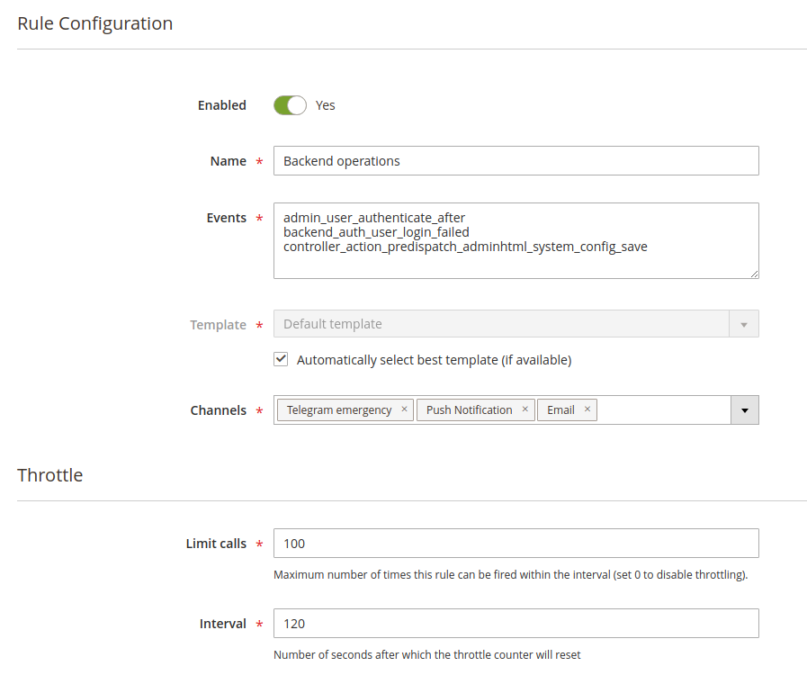
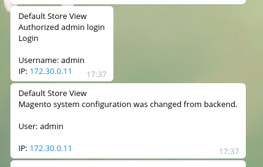
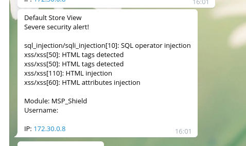

# Events Driven Notifications

This feature is provided by `MSP_NotifierEvent` package.

Composer: `composer require msp/module-notifier-event`. 
GitHub Source: https://github.com/magespecialist/notifier-event

## Introduction

This module is the real power of MSP_Notifier allowing you **to be notified when a Magento event is triggered**.

You can attach **any Magento observer event** and receive real time notification when **something relevant for you happens**.

For example you can get notified when a new order is added, when an import procedure fails, when someone tries to login from backend
with wrong credentials and so on. **There is no real limit on the events you can observe**.

## How does it work

Event rules are defined from Magento backend and bound **one or more events** to a **template** and **one or more channels**.

A message will be sent **every time one event you listed is triggered** by Magento observer mechanism.

The triggered event will be passed to `MSP_NotifierTemplate` module with a **TWIG template** that will be filled by event's information and then eventually sent through **one or more channels**.

Since you may want define multiple events for a single rule, an **automatic template selection mechanism is provided**.
If a template with code `event:your_triggered_event_name` exists, the it will be used to render you message.

Click [here](./Templates) to see how to define templates.

## Message Throttling

In order to avoid a flood of messages under some circumstance, we provided a throttling mechanism based on a **number of messages** and 
an **amount of time**.

If you define for example `Limit Calls`=100, `Interval`=120, your messages on this rule will be limited to maximum 100 messages each 120 seconds.

## Message example received through a Telegram channel:

## Integration example with MSP SecuritySuite

 

