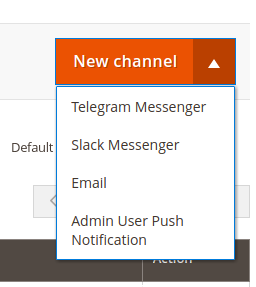
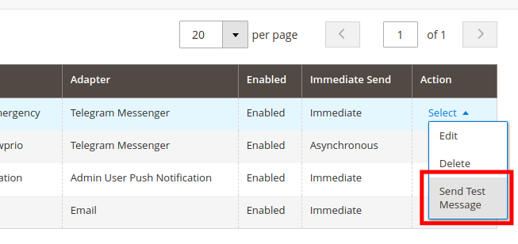

# Fundamentals

MSP Notifier is based on two main entities:

- Adapters
- Channels

Each adapter and each channel have a unique alphanumeric `identifier` that you can use to reference them.

## Adapters

An adapter is a set of classes created by a Magento developer to **integrate an external messaging software**
(i.e.: Telegram, Slack, email, ...).

### Adding new adapters

If you need to **add more adapters you can do it**, but if you are not a Magento developer, you probably need to hire one.

## Channels

A channel is basically an **adapter configured** with a certain set of parameters.

Example: 
If we want to send a **Telegram message** to an imaginary user **John Doe**, we should create a channel
over the `Telegram` adapter and configure it with John Doe `chat_id` destination.

We can have multiple channels using the same adapter, so if you need multiple channels setup or recipients, you can do it.

### Adding new channels

Channels can be directly added from Magento backend.

1. Open `System > MageSpecialist Notifier > Manage Channels`
2. Click the **small arrow** in `New Channel` button and select the adapter type for your channel:
 
3. Fill in the general information paying attention to **identifier uniqueness**.
Identifiers should be **alphanumeric only** and **without spaces**.
4. Each adapter may require some additional and specific parameter. Check the adapter's guide if you need further information.

> If you have `msp/module-notifier-queue` installed, you will see some additional parameters in the **Message queueing** section.
> Click [here](./Queue) to see how to handle asynchronous messages.

### Testing a channel

After a channel is configured, you may want to test it to make sure everything is fine.

You can use the test message feature:

If you correctly configured you channel you should receive a test message in few seconds.
