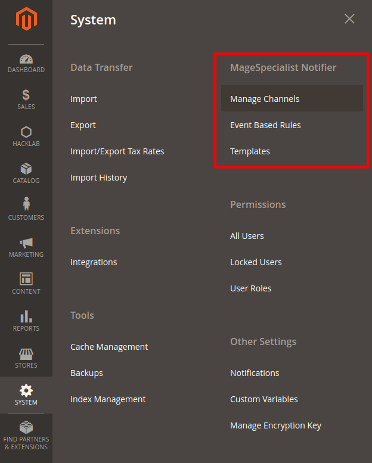

# Introduction

**MSP Notifier** is a messaging framework for Magento 2 allowing users and developers to **easily integrate a wide set
of communication channels** (Telegram, Slack and others) for real-time notification.

## Project philosophy

MSP Notifier Project is an extensible tool projected around the **Domain Driven Development** best practices.
In other word: it is a **set of smaller modules** with well defined responsibilities and features.
You can decide to install the whole set of modules or just the ones you need.

Each single component is provided with a **full set of SPI and API** allowing extensibility and features replacements with guaranteed backward compatibility.

## Application examples

- Real Time Security notifications
- Adding messaging features as service to your customers
- Getting notified when something relevant happens in your store
- ...

# Oh, come on dude... I have no time to read the whole wiki. 

Ok, if you do not have time to read this wiki I have to warn you that you are missing out :P

Here you have the short version:

```
composer require msp/module-notifier-all
bin/magento setup:upgrade
```

Open your admin under `System > MSP Notifier` menù and enjoy it ;)<br />
If you need to understand how does it work... then you need to read this wiki. Sit down, grab a cup of tea and read it.



## Examples with Telegram notification


