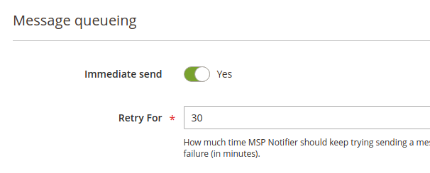

# Asynchronous Queue

This feature is provided by `MSP_NotifierQueue` package.

Composer: `composer require msp/module-notifier-queue`. 
GitHub Source: https://github.com/magespecialist/notifier-queue

## Introduction

MSP Notifier messages can be handled in two ways:

- Immediate send
- Asynchronous send

This feature was added to **avoid impacting the user experience** if a messages takes time to be delivered and to
add a **retry on failure capability**.

## How does it work

If you have this module installed, you will see two additional parameters in your channels configuration:

 

- **Immediate Send**: If enabled will try to send the message synchronously
- **Retry For**: MSP Notifier will try to deliver this message for the defined amount of minutes in case of failure

### Immediate send

Since **Immediate send** option will try to **synchronously delivery your message**, it should be used for high priority messages only.

This is probably **the best option for security or critical notifications**. 

> If the synchronous send fails, your message will be queued and delivered as asynchronous message.

## Handling the queue

Asynchronous queue is **handled by Magento cron**, but you may also want to manually handle it using the following command:

`bin/magento msp:notifier:queue:send`

Old messages are kept for 7 days (default configuration) and then removed by a Magento cron triggered command.
If you want to manually run the old messages cleaning mechanism, you can use the following command:

`bin/magento msp:notifier:queue:clean`
