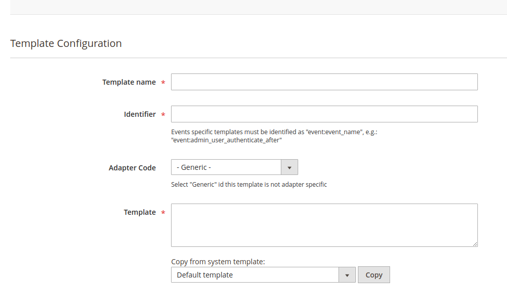

# Templates

This feature is provided by `MSP_NotifierTemplate` package.

Composer: `composer require msp/module-notifier-template`. 
GitHub Source: https://github.com/magespecialist/notifier-template

## Introduction

This module provides an integration with TWIG templates in order to simplify the notification messages management. 
Adding or modifying a template can be done **both from code and Magento backend**.

Templates provided via code are called `System Templates`, while templates modified or provided from Magento backend are called `Database Templates`.

Click [here](./Developers-Templates) to see, in the developer section, how to define a new `System Template`.

## Define a template from Magento backend

Login your Magento backend and open `System > MageSpecialist Notifier > Templates` and click `New Template`.

Fields:

- **Template Name**: Feel free to type in whatever you like, but we suggest to use a descriptive name
- **Identifier**: This is a unique identifier we can use to reference this identifier
- **Adapter Code**: Select an adapter only if this template must be used with a specific adapter, otherwise leave `- Generic -`
- **Template**: A twig template. Variables will be provided depending on the context
    - If you do not want to start a template from scratch, you can copy it from an existing `System Template`. Select from the dropdown and click `Copy`

> Notes on **Identifier** field:
> If you have `msp/module-notifier-event` package installed and you want to create a template for a Magento event notification,
> then you must use `event:event_name` as identifier (e.g.: `event:admin_user_authenticate_after`).

## Variables

A set of system variables is provided from basic package. Click [here](./Developers-Templates#Variables) to see, in the developer section, how to define new system variables.  

System variables:

- `_store`: Current store object
- `_ip`: Remote IP 
- `_request`: Magento Request object
- `_adminUser`: Logged in admin user (for backend messages)

> If you have `msp/module-notifier-event` package installed and you are defining a template to be used for events notification, then you can also 
rely on events variables. There is not an extensive list of variables, but you can inspect the Magento code and see what is the event payload.
